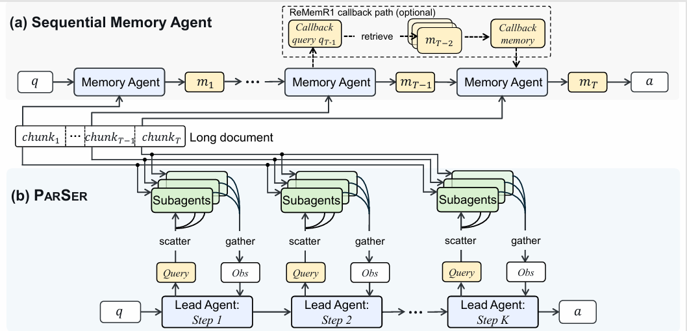

# PARSER

Official implementation of **PARSER**, a multi-agent framework for long-context
reasoning. PARSER uses a lead agent to iteratively reason about a question and
scatter queries to subagents that process different chunks of a long document.
The gathered observations are returned to the lead agent until it produces the
final answer.



## Repository layout

```text
.
├── chat_template.jinja   # Qwen3.5 lead-agent chat template
├── data/                 # Training and evaluation data (download separately)
├── eval/                 # HotpotQA and 2WikiMultiHopQA evaluation
└── train/                # Training code and launch scripts
```

## Model preparation

Both the lead agent and the subagents use Qwen3.5. The original Qwen3.5 chat
template omits thinking content from earlier assistant turns. PARSER requires
that content to remain visible to the lead agent, so copy the template supplied
in this repository into the lead-agent checkpoint:

```bash
cp chat_template.jinja /path/to/Qwen3.5-lead-agent-checkpoint/chat_template.jinja
```

The subagent checkpoint can use the original Qwen3.5 chat template.

## Installation

PARSER has been tested with CUDA 12.8/12.9. Before installing the dependencies,
edit the first two lines of `train/env_setup.sh` so that `CUDA_HOME` points to
your CUDA installation:

```bash
cd train
# Edit CUDA_HOME in env_setup.sh first.
bash env_setup.sh
```

PARSER uses NGINX as a local proxy to efficiently reuse connections to SGLang
services across nodes. Install it on the training node, for example:

```bash
sudo apt-get update
sudo apt-get install -y nginx
```

If NGINX is installed at a nonstandard location, set
`LONGMAS_NGINX_BIN=/absolute/path/to/nginx`. The training launcher starts and
stops the required local NGINX proxies automatically.

## Data

Download the complete
[inNexus/parser_dataset](https://huggingface.co/datasets/inNexus/parser_dataset)
repository into `data/` at the repository root:

```bash
cd /path/to/PARSER
hf download inNexus/parser_dataset \
  --repo-type dataset \
  --local-dir data
```

The resulting layout should be:

```text
data/
├── train/
│   └── hotpotqa_train_process_emb-select_llm-unable.parquet
├── hqa_val/
└── 2wiki_val/
```

## Training

### 1. Start the subagent service

Edit `train/set_sglang_router.sh` and configure:

- `--served-model-name`: the subagent model name;
- `--model-path`: the subagent checkpoint path;
- `--dp-size`: the number of data-parallel workers;
- `--host` and `--port`: the address exposed by the router.

Start the SGLang Router in a separate terminal:

```bash
cd train
bash set_sglang_router.sh
```

Record its address as `HOST:PORT`. Multiple routers may be launched on
different nodes or ports to provide additional subagent capacity.

### 2. Configure training

Set the lead-agent Qwen3.5 checkpoint in
`train/run_fully_async_parser_4b.sh` (`model_path`) and list all SGLang Router
addresses in `train/train_4b.sh`:

```bash
export LONGMAS_SGLANG_UPSTREAMS=host1:port1,host2:port2
```

The value must contain router addresses without the `/v1` suffix.

### 3. Launch training

```bash
cd train
bash train_4b.sh
```

The default configuration trains a Qwen3.5-4B lead agent with fully
asynchronous GRPO. Hardware and optimization settings can be overridden with
the environment variables defined in `train/run_fully_async_parser_4b.sh`.

## Evaluation

Evaluation reuses the SGLang Router service used by the subagents. Apart from
the GPUs serving the subagents, evaluating the lead agent requires one GPU.

For HotpotQA, edit `eval/eval_hqa.sh`:

1. Set `CUDA_VISIBLE_DEVICES` to the GPU used by the lead agent.
2. Set `URL` to the router API endpoint, including `/v1`.
3. Set `SUBAGENT_MODEL` to the router's served model name.
4. Set `TOKENIZER_PATH` to the original Qwen3.5-4B checkpoint.
5. Add the trained lead-agent checkpoint path to `MODELS`.

Then run:

```bash
cd eval
bash eval_hqa.sh
```

Use the equivalent script for 2WikiMultiHopQA:

```bash
cd eval
bash eval_2wiki.sh
```

The scripts preprocess each evaluation split when necessary and write the
predictions under their respective evaluation output directories.

## Citation

Citation information will be added upon publication.

## Acknowledgements

This repository builds on
[Qwen](https://github.com/QwenLM/Qwen3),
[SGLang](https://github.com/sgl-project/sglang),
[VERL](https://github.com/volcengine/verl), and
[Megatron-LM](https://github.com/NVIDIA/Megatron-LM).

## License

This project is released under the [MIT License](LICENSE).
